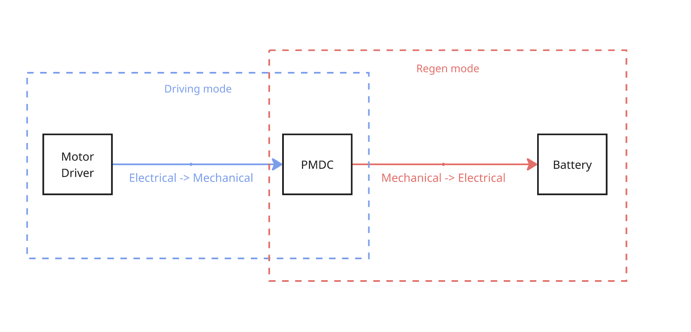

# Regenerative Braking System

 

## Overview
Regenerative braking is a key technology in electric vehicles that recovers kinetic energy during deceleration and converts it into usable electrical energy. Instead of dissipating energy as heat, this system improves overall efficiency, extends driving range, and reduces mechanical wear.

This project demonstrates a small-scale regenerative braking system that converts rotational kinetic energy into electrical energy using a DC motor as a generator, with energy stored for later use.

## Design Goals & Objectives
The objective of this project is to design a regenerative braking system capable of converting kinetic energy into electrical energy during deceleration and storing it efficiently. The system aims to achieve an energy recovery efficiency of at least %, operate within a 12–24V range, and safely manage current flow using a controlled power electronic interface. Additional goals include ensuring system safety, minimising energy losses, and maintaining reliable operation under repeated braking conditions.

## System Architecture
The system operates by switching a PMDC motor from motoring mode (electrical → mechanical) to generating mode (mechanical → electrical) during braking. The rotational inertia of the system drives the motor, producing electrical energy which is then conditioned and stored.

 

## Mechanical Design
The mechanical system consists of a rotating wheel directly coupled to a PMDC motor. During braking, the kinetic energy of the rotating wheel is transferred to the motor shaft, causing it to act as a generator.

For detailed design and considerations:
- [Mechanical Design](docs\mech.md)

## Electrical Design
The electrical subsystem switches the motor from driving mode or regenerative mode. During driving mode, users may control the acceleration of the motor. During regenerative mode, the AC voltage is rectified and boosted into a capacitor for storage.

For full circuit design and explanation:
- [Electrical Design](docs\elec.md)

## Software
A PID loop is used to control the PWM of the DC-DC converter, ensuring output voltage remains constant towards the battery. Other software include the swtiching mechanism and driving PWM.

- [Software Design](docs\software.md)

## Results
In Progress: The project aims to

- Measure energy saved from regenerative breaking
- Successfuly store energy in energy storing element
- Noticeable mechanical resistance corresponding to regenerative braking

Full Results:

- [Results and Analysis](docs\results.md)

## Final Project

 

## Future Improvements

- Our system had some siginficant issues when connecting a low resistance load, namely the DC-DC converter will go into DCM mode, rendering our PID useless. A higher PWM freqency could be used to improve this.
- Our mechanical design was tested with 6V instead of the rated 12V, due to saftey concerns, a more stable build is needed to test with higher speeds.
- We had an issue with a wire burning up with no apparent reason, further analysis needed.
- There was a lack of noticable breaking of the wheel. The wheel span for 20 seconds without regen, and around 18 seconds with regen. This may be due to the use of a high resistance load, causing less current being able to flow.
