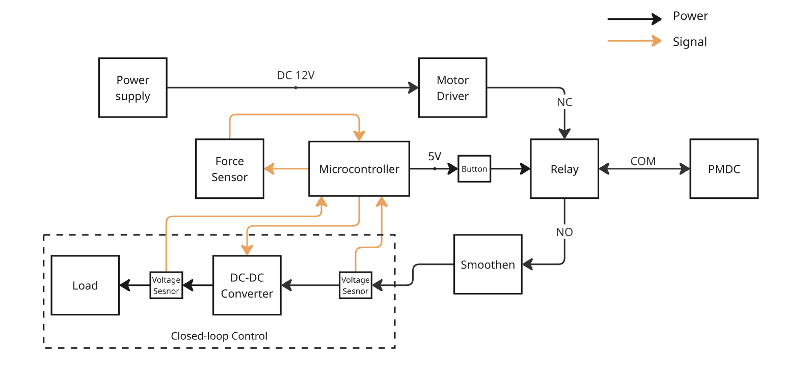
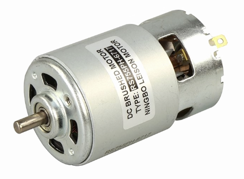
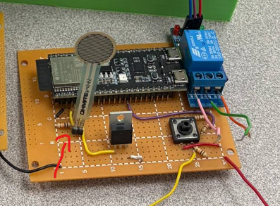
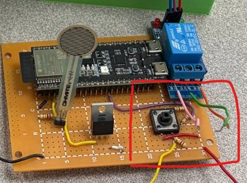
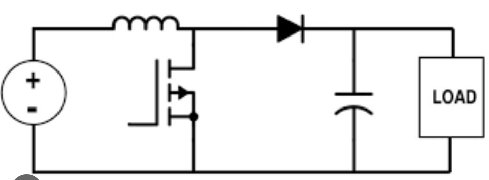
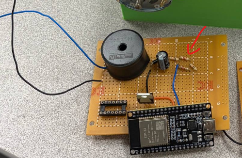

# Electrical System

## 1. Design Objectives

The electrical system was designed to enable energy conversion, voltage regulation, and controlled regenerative braking.

The key objectives were:
- To convert mechanical energy into electrical energy using a generator  
- To regulate the generated voltage to a stable output of 6.6 V  
- To implement a closed-loop control system using a PID controller  
- To safely manage current and voltage within system limits  
- To interface with sensors and actuators for real-time control  

## 2. System Overview

The electrical system consists of two main subsystems:

1. **Acceleration and Braking Controller** – A system to control breaking and acceleration 
2. **Power Conversion** – A boost converter steps up and regulates the generated voltage with a closed-loop control.

## 3. Key Components and Design Choices

## 3.1 Acceleration and Braking Controller (SSM)

### 3.1.1 Generator/DC Motor

A RS-775-R 12V-24V DC motor is used as the generator and motor to convert rotational energy into electrical energy via electromagnetic induction and vice versa. The motor was chosen due to its high RPM capabilities with low torque.

Since generated voltage is proportional to rotational speed, this would be suitable as the high RPMs allow us to observe these effects greatly. 

This dependency directly affects the performance of the system, especially at lower operating voltages.

### 3.1.2 Force sensor

A Round Force Sensor (FSR402) was used to simulate the accalerator pedal in cars. It works by increasing the resistance as more force is applied. 

The connections are as follows:
- Connected to a 3.3V high output pin in the esp32
- Pulldown resistor on output to reduce noise and floating voltage
- Input to a standard GPIO analog pin

### 3.1.3 Relay and Button Switching

A standard relay with 5V switching was used to change between the modes of braking and non-braking. The relay switches to NO when the signal pin is put to ground, and NC otherwise.

The connections are as follows:
- The relay is grounded via a resistor to prevent current surge and floating voltages, this leaves the default state at NC, where this is in non-braking mode
- One end of the button is put to the 5V high from the arduino
- When the button is pressed, the signal wire from the relay is set to a 5V high, switching the relay circuit from non-braking to braking mode.
- A voltage devider is used to split the voltage of 5V to 3.3V to allow the button status to be read digitally as well

## 3.2 Power conversion

### 3.2.1 Boost Converter

A standard boost converter was made to step up the variable input voltage from the generator to a stable output voltage.

The converter operates using:
- A MOSFET controlled by PWM  
- An inductor for energy storage  
- A diode and capacitor for output smoothing  

By adjusting the duty cycle of the PWM signal, the output voltage can be controlled.

### 3.2.2 Voltage Sensing (ADC System)

The ESP32 ADC operates in continuous sampling mode to measure:
- Output voltage (Vout)  
- Input voltage (Vin)  

To measure these voltages, a voltage divider was used to scale the voltage readings to the 3.3V analog input in the esp32.

Key features:
- High-frequency sampling (~50 kHz)  
- Averaging of multiple samples to reduce noise  
- Calibration using eFuse-based correction  
- Voltage divider scaling to measure higher voltages  

This enables accurate real-time feedback for the control system.

### 3.2.3 PWM Control (LEDC Module)

The ESP32 LEDC module generates a PWM signal to control the boost converter.

- Frequency: 4 kHz  
- Resolution: 13-bit  
- Duty cycle range: 0 to 7500  

The duty cycle determines how much energy is transferred through the converter:
- Higher duty cycle → higher output voltage  
- Lower duty cycle → lower output voltage  

## 4. Control System (PID Controller)

A PID controller is implemented to regulate the output voltage to a target of **6.6 V**.

The control law is:

- Proportional term responds to present error  
- Integral term accumulates past error  
- Derivative term predicts future error  

The controller continuously:
1. Measures output voltage  
2. Computes error relative to target  
3. Updates PID terms  
4. Adjusts PWM duty cycle  

## 5. System Behaviour and Performance

The system successfully maintained a stable output voltage of approximately **6.6 V for 15 seconds**, demonstrating effective closed-loop control.

However, performance was affected under certain conditions:

- When connected to a low-resistance load, the converter entered **Discontinuous Conduction Mode (DCM)**  
- In DCM, the system dynamics changed, reducing the effectiveness of the PID controller  
- This resulted in reduced stability and control accuracy  

Additionally:
- Limited input voltage (due to low rotational speed) restricted overall system performance  
- High resistance loads reduced current flow, limiting braking effectiveness  

## 6. Electrical Issues Encountered

### 6.1 DC-DC Converter Instability
The converter became unstable under heavy load conditions due to transition into DCM. This caused the PID controller to behave unpredictably.

### 6.2 Wire Overheating
A wire was observed to burn during operation, indicating excessive current or insufficient wire rating.

Possible causes include:
- Undersized wire gauge  
- Lack of current limiting  
- Unexpected current spikes  

### 6.3 Limited Power Transfer
The system exhibited limited braking performance due to low current flow, which reduced electromagnetic braking torque.

## 7. Limitations of Current Design

- Operation limited to **6 V instead of 12 V**  
- PID tuning not optimised for different operating modes (CCM vs DCM)  
- Lack of current protection mechanisms  
- Inefficient power transfer under certain load conditions  
- Limited switching frequency affecting converter performance  

## 8. Improvements and Future Work

- Increase PWM switching frequency to reduce DCM operation  
- Implement **current sensing and protection** (e.g., shunt resistor, fuse)  
- Optimise PID tuning for different operating conditions  
- Improve component selection (MOSFET, inductor, wiring) for higher current handling  
- Enable safe operation at **12 V** to improve performance  
- Add filtering or compensation to improve stability  

## 9. Summary

The electrical system successfully demonstrated energy conversion and voltage regulation using a closed-loop control system.

While stable voltage output was achieved, performance was limited by converter dynamics, load conditions, and hardware constraints. Further optimisation of both control and hardware design is required to fully realise effective regenerative braking.