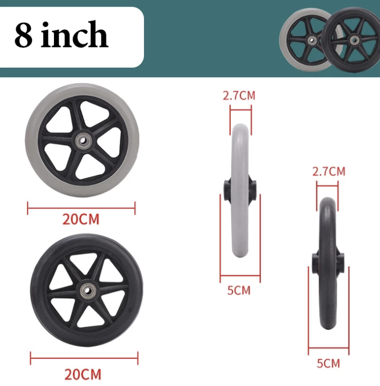
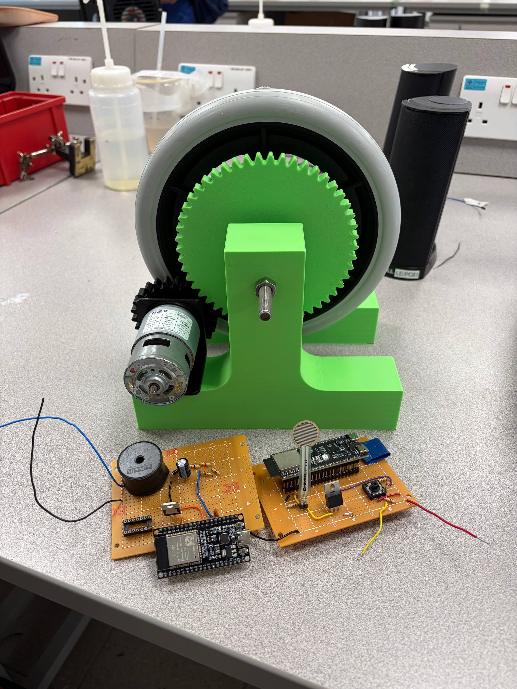
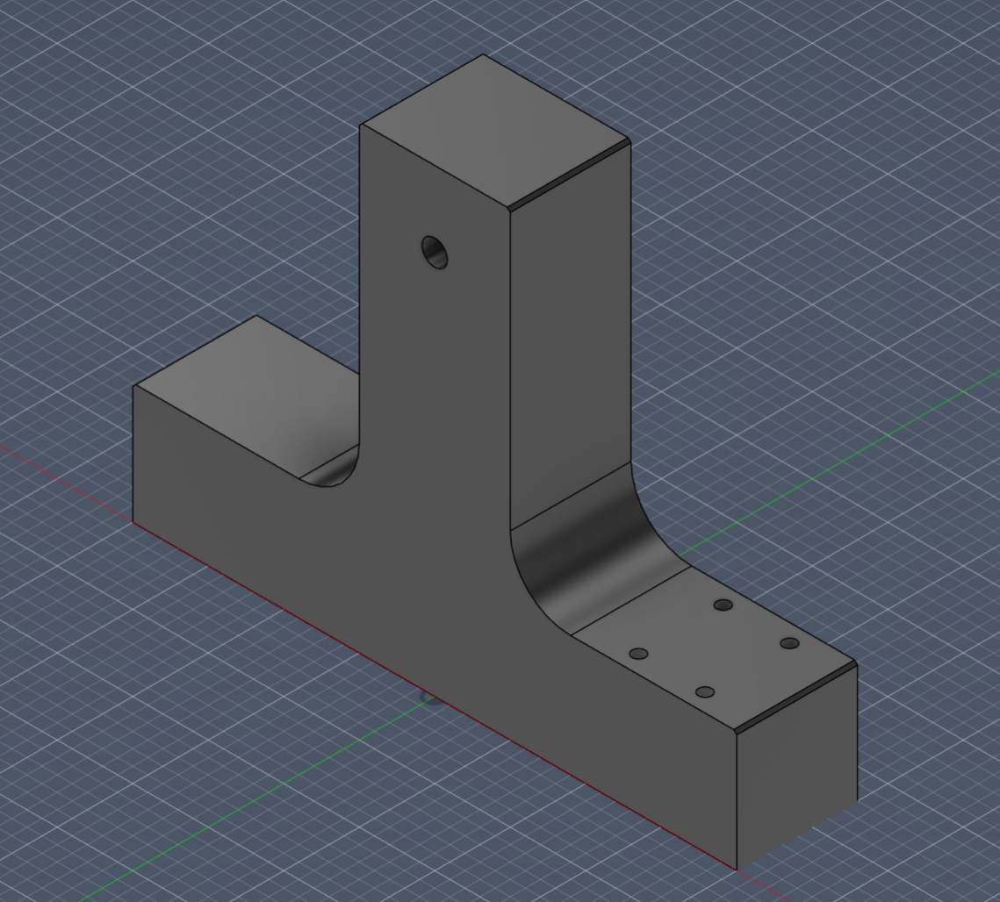

# Mechanical Design

## 1. Design Objectives

The mechanical system was designed to provide stable rotational support for the flywheel while enabling sufficient momentum to be stored in the wheel to observe regenerative breaking.

The key objectives were:
- To provide stable support for the rotating wheel  
- To minimise frictional losses during rotation  
- To ensure effective coupling between the wheel and generator  
- To reduce the speed of the wheel by using a correct gear ratio
- To allow enough momentum for a stable back emf to be produced.

## 2. Overall Design Description

The system consists of a rotating wheel mounted on a shaft, which is mechanically coupled to a motor acting as a generator. The generated electrical energy is then processed by the boost converter circuit.

Energy flow in the system can be summarised as:

**Mechanical Energy (wheel rotation) → Gear Reduction → Generator/Motor**

The wheel stores kinetic energy, which is partially recovered during regenerative braking when the generator applies an opposing torque.

---

## 3. Key Components and Design Choices

### 3.1 Flywheel

A 8-inch wheelchair wheel was used as the flywheel element in the system. The primary function of the flywheel is to store kinetic energy, which can then be converted into electrical energy during braking.

However, due to its relatively low mass, the flywheel has low rotational inertia. This limits the total amount of recoverable energy and reduces the observable effect of regenerative braking.

The wheel also came with a bearing attached to the centre bore, allowing for free motion between the shaft and wheel.

---

### 3.2 Shaft and Gears

- The wheel is mounted onto a threaded rod that is locked in to the supports via 8 inch nuts.
- One gear is connected directly to the wheel, while the other is connected towards the motor. The gear ratio used is 1:2, with PLA material andpress fitted on the wheel and motor.
- A motor bracket was used to secure the motor into place, using 6mm threaded inserts and screws into the supports.

---

### 3.3 Structural Frame

The structural frame was constructed using a PLA material and were fully 3d-printed. While sufficient for low-speed testing, the frame lacked rigidity. 

This resulted in:
- High vibrations at higher rotational speeds  
- Safety concerns when operating at the intended 12 V  
- Restriction of testing to 6 V operation  

---

## 4. System Performance Analysis

The mechanical design directly influenced the experimental results.

- The wheel spin time was observed to be approximately 20 seconds (without regenerative braking) this proved that there was minimal friction between the bearking and the supports, this allowed us to carry enough momentum and observe regenerative braking results if there were any.  
- The machine underwent heavy vibrating in higher RPMS. As a result, a human operator had to hold down the build while the wheel was spinning at high rpms, and we were capped at 6V operation.
- The gears fit nicely with each other, with no gear interfearence observed. However, loud sounds were produced due to using spur gears.

---

## 5. Limitations of Current Design

The current mechanical design has several limitations:

- **Low structural rigidity**, preventing safe high-speed operation  
- **Low flywheel inertia**, limiting energy storage capacity  
- **Higher friction losses** due to basic support structure  
- **Lack of safety enclosure**, restricting testing conditions  

These limitations contributed to the reduced performance observed in the system.

---

## 6. Improvements and Future Work

Several improvements can be made to enhance the mechanical performance:

- Use a **heavier flywheel** to increase rotational inertia and energy storage  
- Construct a **more rigid frame** (e.g., aluminium or reinforced structure)  
- Add a **protective enclosure** to enable safe high-speed testing  
- Ensure secure mounting of all components to minimise vibration  

These improvements would allow the system to operate at higher speeds and significantly enhance the effectiveness of regenerative braking.

---

## 7. Summary

The mechanical system successfully enabled rotational motion and energy transfer; however, its performance was limited by structural and design constraints.

While functional at low voltage, the design requires further refinement to achieve efficient and safe operation under higher loads, particularly for demonstrating effective regenerative braking.