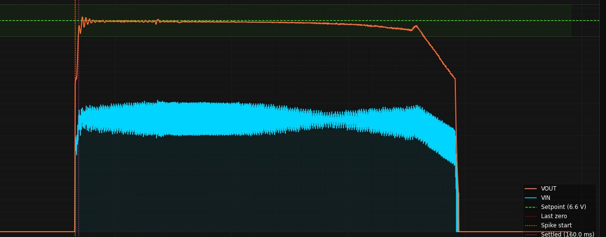

# Results and Analysis

## 1. Overview of Results
The prototype demonstrated successful operation, maintaining a steady back voltage of **6.6 V** for approximately **15 seconds** under controlled conditions. This indicates that the regenerative system is capable of stable energy conversion within the tested parameters.

 

## 2. Key Experimental Results
- The system maintained a back steady back voltage of **6.6 V for 15 seconds**
- Without regenerative braking, the wheel spun for approximately **20 seconds**
- With regenerative braking, the wheel spun for approximately **18 seconds**
- Testing was conducted at **6 V instead of the rated 12 V** due to safety concerns
- PID was tuned sufficiently until no oscilation was found from the varying back voltage.

 

## 3. Analysis of System Performance
The relatively small reduction in wheel spin time (from 20 s to 18 s) suggests that the regenerative braking effect was minimal. This is likely due to the use of a **high-resistance load**, which limited current flow and therefore reduced the electromagnetic braking torque.

Additionally, operating the system at **6 V instead of 12 V** reduced the rotational speed and back EMF generated, further limiting the observable performance of the regenerative braking system.

 

## 4. Identified Issues and Technical Explanation

### 4.1 DC-DC Converter Instability
When connected to a low-resistance load, the DC-DC converter entered **Discontinuous Conduction Mode (DCM)**, rendering the PID controller ineffective. This occurs because the system dynamics change significantly in DCM, making the existing PID tuning unsuitable. Increasing the PWM switching frequency could help maintain **Continuous Conduction Mode (CCM)** and improve system stability.

 

### 4.2 Mechanical Limitations
The system was only tested at **6 V** due to safety concerns regarding the structural integrity of the setup. At this lower voltage, the system operates at reduced speed, limiting both energy generation and braking performance. A more robust mechanical design is required to safely test the system at its intended **12 V operating condition**.

 

### 4.3 Electrical Fault (Wire Overheating)
A wire was observed to burn during operation, indicating a possible **overcurrent condition** or insufficient wire gauge. This suggests that the current exceeded safe limits, highlighting the need for proper current rating calculations and protective components such as **fuses or current limiting mechanisms**.

 

### 4.4 Limited Braking Effect
The minimal difference in stopping time indicates weak regenerative braking performance. This is likely due to the **high-resistance load**, which restricts current flow. Since braking torque is proportional to current, increasing current flow (e.g., by reducing load resistance or improving power handling capability) would result in stronger braking.

 

## 5. Evaluation Against Objectives
While the system successfully demonstrated **voltage regulation**, it did not achieve significant braking performance. This suggests that the electrical control aspect of the system is functional, but further optimisation of load conditions, control strategy, and mechanical design is required to fully achieve the objectives of effective regenerative braking.

 

## 6. Improvements and Future Work
- Increase PWM switching frequency to reduce the likelihood of DCM operation  
- Redesign the mechanical structure to safely support **12 V testing**  
- Use appropriately rated wires and implement **overcurrent protection**  
- Optimise load resistance to allow higher current flow and improve braking torque  
- Retune the PID controller for different operating modes (CCM vs DCM)  

 