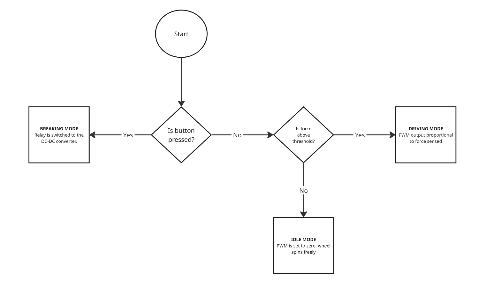
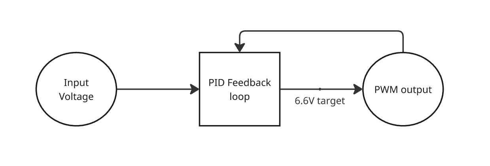

# Software

The software portion of this project can be divided into two main components:

- Small State Machine (User Input & System Control)
- Boost Converter Feedback Loop (Voltage Regulation)

 

## Small State Machine

The small state machine is responsible for controlling when regenerative braking is active, based on user input and force detection.

A force sensor is continuously read using the ADC, and its value is mapped to a PWM signal. This PWM signal controls the level of braking applied.

A button input is used to toggle the braking system:
- When the button is pressed, braking is **disabled**
- When the button is not pressed, braking is **enabled**

The system operates in three main states:

1. **Driving and Acceleration**
    - Activated when the measured force is above the predefined threshold and active breaking is not enabled
    - PWM is proportional to force applied on sensor
    - The system accelerates

2. **Idle / No Braking**
   - Activated when the measured force is below a predefined threshold and active braking is not enabled  
   - PWM output is set to 0 
   - The system does not apply any braking force 

3. **Active Braking**
   - Activated when the button is pressed, regardless of the force sensor input
   - PWM output is set to zero
   - A relay and digital output are activated to engage the braking circuitry into the boost converter

This simple logic ensures that braking only occurs when required, preventing unnecessary energy dissipation and improving system control.

 

## Boost Converter Feedback Loop

The boost converter feedback loop is implemented on the ESP32 using a PID controller to regulate the output voltage.

### Signal Acquisition
- Two ADC channels are used:
  - One measures the **output voltage (Vout)**
  - One measures the **input voltage (Vin)**
- The ADC operates in continuous sampling mode at high frequency
- Raw ADC values are averaged and calibrated to obtain accurate voltage readings
- A voltage divider scaling factor is applied to reconstruct the actual voltage

 

### PID Control System

The system regulates the output voltage to a target of **6.6 V** using a PID controller.

- **Proportional term (P):** Responds to instantaneous voltage error  
- **Integral term (I):** Accumulates past error to eliminate steady-state offset  
- **Derivative term (D):** Predicts future error based on rate of change  

The control loop performs the following steps:
1. Measure output voltage  
2. Compute error between measured voltage and target voltage  
3. Update PID terms (with integral windup limiting)  
4. Adjust PWM duty cycle accordingly  

The PWM signal is generated using the ESP32 LEDC module and drives the boost converter switching element.

 

### Control Features and Safeguards

- **Integral windup protection:** Limits the integral term to prevent instability  
- **Duty cycle clamping:** Ensures PWM stays within safe bounds  
- **Noise floor handling:** Resets control when voltage is too low  
- **Dynamic timestep (dt):** Improves accuracy of derivative and integral calculations  

 

### System Behaviour

- When output voltage is below 6.6 V, the controller increases PWM duty cycle to boost voltage  
- When output voltage exceeds 6.6 V, the controller reduces duty cycle  
- The system continuously adjusts in real time to maintain a stable output voltage  

 

## Summary

The software integrates a high-level control system (state machine) with a low-level control loop (PID-regulated boost converter).  

- The **state machine** determines *when* braking should occur  
- The **PID controller** determines *how much* energy is transferred and regulates voltage  

Together, they enable controlled and stable regenerative braking operation.